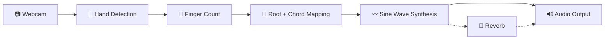

<p align="center">
  <h1 align="center">🎵 AI Harmonizer</h1>
  <p align="center">
    <strong>Hand Gesture Controlled Musical Synthesizer</strong><br>
    Play chords in real-time using just your hands and a webcam.
  </p>
  <p align="center">
    
    
    
    
  </p>
</p>

---

## 📖 About

The AI Harmonizer uses your webcam to track both hands simultaneously via [MediaPipe](https://developers.google.com/mediapipe). Each hand controls a different musical parameter:

- **Left hand** — selects the **root note** by raising fingers (0–5)
- **Right hand** — selects the **chord type** by raising fingers (0–5)

Audio is synthesized in real-time using NumPy and streamed through [sounddevice](https://python-sounddevice.readthedocs.io/).

---

## 🎹 Gesture Mappings

<table>
<tr>
<td>

### Left Hand — Root Note

| Fingers | Note |
|:-------:|:----:|
| ✊ 0 | A |
| ☝️ 1 | C |
| ✌️ 2 | D |
| 🤟 3 | E |
| 🖖 4 | F |
| 🖐️ 5 | G |

</td>
<td>

### Right Hand — Chord Type

| Fingers | Chord |
|:-------:|:-----:|
| ✊ 0 | Major |
| ☝️ 1 | Minor |
| ✌️ 2 | Maj7 |
| 🤟 3 | 7 (Dom7) |
| 🖖 4 | Aug |
| 🖐️ 5 | Aug7 |

</td>
</tr>
</table>

### Special Gestures

| Gesture | Action |
|:--------|:-------|
| 🤏 Pinch (thumb + index close) | Toggle reverb effect |

---

## ⌨️ Keyboard Controls

| Key | Action |
|:---:|:-------|
| `q` / `ESC` | Quit |
| `r` | Toggle reverb |
| `+` | Octave up |
| `-` | Octave down |

---

## 🚀 Getting Started

### Prerequisites

- **Python 3.10**
- A webcam
- Audio output device (speakers / headphones)

### Installation

```bash
# 1. Clone the repository
git clone https://github.com/Lidiman/EDITH.git
cd EDITH

# 2. Create a virtual environment (recommended)
python -m venv venv
source venv/bin/activate       # Linux/macOS
# venv\Scripts\activate        # Windows

# 3. Install dependencies
pip install -r requirements.txt

# 4. Download the MediaPipe hand landmark model
wget -O hand_landmarker.task \
  https://storage.googleapis.com/mediapipe-models/hand_landmarker/hand_landmarker/float16/latest/hand_landmarker.task
```

### Run

```bash
python harmonizer.py
```

> **Note:** Make sure your webcam is connected and accessible before running.

---

## 📦 Dependencies

| Package | Version | Purpose |
|:--------|:-------:|:--------|
| `opencv-python` | ≥ 4.8.0 | Webcam capture & HUD rendering |
| `mediapipe` | ≥ 0.10.0 | Hand landmark detection |
| `numpy` | ≥ 1.24.0 | Audio signal generation |
| `sounddevice` | ≥ 0.4.6 | Real-time audio output |

---

## 🏗️ Architecture

```
harmonizer.py
├── HarmonizerEngine    — Real-time audio synthesis (sine waves + reverb)
├── GestureDetector     — MediaPipe hand tracking & finger counting
├── HUD Drawing         — On-screen status, waveform, finger indicators
└── Main Loop           — Camera → gesture detection → audio mapping → display
```

### Audio Pipeline



1. Finger count is read from each hand
2. Root note + chord type are mapped from the counts
3. Chord frequencies are computed (root × interval ratios)
4. Sine waves are generated with slight detuning for richness
5. Optional reverb is applied via delay buffer
6. Output is soft-clipped with `tanh` for clean sound

---

## 🤝 Contributing

Contributions are welcome! Feel free to open an issue or submit a pull request.

1. Fork the repository
2. Create your feature branch (`git checkout -b feature/amazing-feature`)
3. Commit your changes (`git commit -m 'Add amazing feature'`)
4. Push to the branch (`git push origin feature/amazing-feature`)
5. Open a Pull Request

---

## 📄 License

This project is open source and available under the [MIT License](LICENSE).
